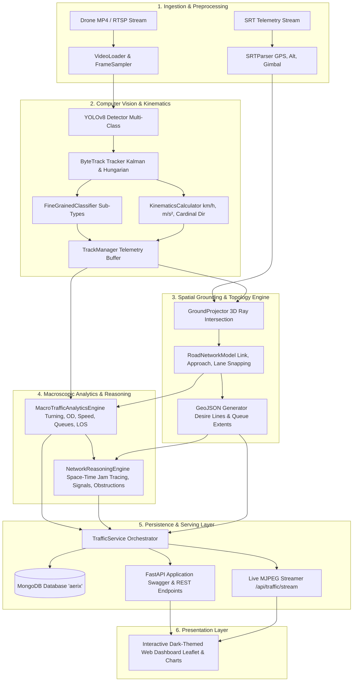
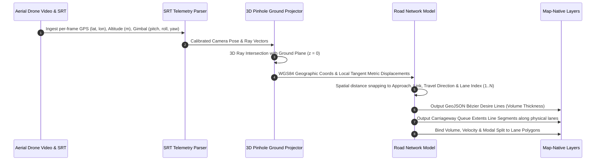

# AERIX — Autonomous Aerial Traffic Intelligence & Macroscopic Analytics Platform

<p align="center">
  
  
  
  
  
  
</p>

---

## 🛰️ Executive Overview

**AERIX** is a visual intelligence and macroscopic traffic analytics platform designed specifically for aerial drone surveillance footage. Engineered from the ground up to solve complex traffic engineering challenges, AERIX transforms raw aerial video and SRT metadata into high-fidelity vehicle kinematics, physical road-topology bindings, and network-wide causal reasoning across space and time.

---

## 🏗️ System Architecture & Workflow

### 1. End-to-End Platform Flow



---

### 2. Spatial Grounding & Ground-Plane Ray Projection Engine



---

## 🌟 Core Pillars & Capabilities

### 1. Detection & Tracking
* **Multi-Class Road User Detection**: High-performance detection of cars, trucks, buses, motorcycles, bicycles, and pedestrians using YOLOv8.
* **ByteTrack Identity Persistence**: Kalman filter motion state estimation with two-stage Hungarian data association to hold stable identities through dense occlusions, crossing trajectories, and extended dwell stops.

### 2. Object-Level Insight & Real-Unit Kinematics
* **Fine-Grained Classification**:
  * `car` $\rightarrow$ `sedan`, `suv`, `hatchback`, `van`
  * `truck` $\rightarrow$ `lgv` (Light Goods Vehicle / Pickup / Delivery Van) vs `hgv` (Heavy Goods Vehicle / Semi / Box Truck)
  * `bus` $\rightarrow$ `minibus`, `transit_bus`, `coach_bus`
  * `motorcycle` $\rightarrow$ `scooter`, `motorcycle`
  * `person` $\rightarrow$ `pedestrian`
* **Real-Unit Kinematics**:
  * Instantaneous and exponential moving average (EMA) smoothed velocity in **$\text{km/h}$** and **$\text{m/s}$**.
  * Dynamic acceleration and deceleration in **$\text{m/s}^2$**.
  * 8-point compass cardinal directions ($\text{N, NE, E, SE, S, SW, W, NW}$) and exact heading angle ($0^\circ - 360^\circ$).
  * Dynamic motion states: `Cruising`, `Accelerating`, `Braking`, `Stopped`.

### 3. Level 3: Aggregate & Macroscopic Traffic Analytics
* **Classified Turning Movements**: Automated intersection maneuver classification (`Through / Straight`, `Left Turn`, `Right Turn`, `U-Turn`) and directional approach volumes (`Northbound`, `Southbound`, `Eastbound`, `Westbound`).
* **Origin–Destination (O-D) Matrix**: Entry gate $\rightarrow$ Exit gate volume distributions and percentage splits.
* **Segment-Wise Speed Profiles & Speeding Hotspots**: Corridor discretization computing Mean Speed, 85th Percentile Speed (P85), 15th Percentile Speed (P15), Speed Variance, and spatial speeding risk heatmaps.
* **Lane Volumes & Modal Split**: Lane-by-lane volume counts, average lane speeds, and vehicle modal breakdown percentages ($\% \text{Cars}, \% \text{Trucks}, \% \text{Buses}, \% \text{Motorcycles}$).
* **Queue Length & Delay Estimation**: Real-world standing queue lengths in meters, queued vehicle count, and average dwell delay behind bottlenecks.
* **Density, Occupancy & Flow–Density (MFD) Relationships**: Traffic density $k$ ($\text{veh/km}$), road area occupancy percentage ($O\%$), hourly flow rate $q$ ($\text{veh/hour}$), and Highway Capacity Manual Level of Service (LOS A through F).

### 4. Spatial Grounding & Map-Native Geometry
* **SRT Telemetry Ingestion (`srt_parser.py`)**: Extracts per-frame drone GPS coordinates ($lat, lon$), altitude ($alt$), gimbal 3D orientation (pitch, roll, yaw), and ISO timestamps.
* **Ground-Plane Camera Projection (`ground_projector.py`)**: 3D pinhole camera ray intersection projecting video bounding box contact points $(u, v)$ to real-world WGS84 geographic coordinates ($lat, lon$) and metric local tangent displacement ($m$).
* **Moment-to-Moment Road Network Binding (`road_network.py`)**: Snaps each vehicle trajectory to the physical road topology: correct **link**, **approach**, **travel direction**, and **lane index** ($1, 2, \dots, N$).
* **Map-Native Desire Lines**: Generates GeoJSON Bézier flow vectors connecting origin approach $\rightarrow$ destination approach over the actual road layout with volume-weighted thickness.
* **Carriageway Queue Extents**: Projects stopped/queued vehicles onto physical lane centerlines to output GeoJSON line segments representing exact queue extents ($m$) along the carriageway.
* **Per-Lane Real Geometry Metrics**: Binds traffic volume, average speed, and vehicle modal breakdown directly to GeoJSON lane polygons.

### 5. Network Reasoning & Space-Time Diagnostics
* **Congestion Origination**: Traces traffic jams back through space and time to pinpoint the exact origin link, lane, time, and root-cause bottleneck.
* **Signal Performance**: Starting and discharge headways, saturation flow rate, green utilisation, cycle failure rate, arrival-on-green, and spillback across adjacent links.
* **Weaving & Conflicts**: Lane changes per kilometre, merge behavior, and conflict concentration hotspots.
* **Desire-Line Deviation Analysis**: Where people actually move against where geometry assumed they would (corner-cutting, lane straddling, informal paths, mis-sited crossings).
* **Obstruction Census**: Spatial identification of double parking, bus-stop blocking, bike-lane obstruction, and loading-zone abuse with exact dwell durations.
* **AI Network Reasoning Synthesis**: Natural language automated diagnostics explaining traffic dynamics across the corridor.

---

## 📁 Repository Directory Structure

```text
.
├── backend/
│   ├── main.py                     # Primary FastAPI application with Swagger Docs & Dashboard
│   ├── requirements.txt            # Python dependencies
│   ├── core/
│   │   ├── config.py               # Settings, MongoDB URI, directories, model configs
│   │   ├── database.py             # Motor async + PyMongo connection manager with fallback
│   │   ├── logger.py               # Unified AERIX logger
│   │   └── security.py             # Core security utilities
│   ├── models/
│   │   ├── __init__.py
│   │   └── traffic_models.py       # Pydantic & MongoDB document schemas
│   └── api/
│       ├── __init__.py
│       ├── traffic.py              # Upload, processing trigger, status, live frame, MJPEG stream
│       ├── analytics.py            # Level 3 aggregate metrics: turning, O-D, speed profiles, queues, LOS
│       ├── spatial.py              # Spatial grounding: SRT flight summary & GeoJSON layers
│       ├── reasoning.py            # Network reasoning: congestion origination, signals, conflicts, obstructions
│       └── telemetry.py            # Object kinematics & individual vehicle track trajectories
├── services/
│   └── traffic_service.py          # Unified service connecting FastAPI <-> ML Pipeline <-> MongoDB
├── ml_pipeline/
│   ├── traffic_pipeline.py         # Autonomous computer vision & kinematics orchestrator
│   ├── ingestion/
│   │   ├── video_loader.py         # Video metadata and frame streaming
│   │   ├── frame_sampler.py        # Frame rate sampling & downsampling
│   │   └── rtsp_stream.py          # RTSP live network stream connector
│   ├── detection/
│   │   ├── yolo_detector.py        # YOLOv8 traffic detector with confidence thresholds
│   │   ├── fine_grained.py         # Geometric & visual vehicle subclassifier
│   │   └── preprocessing.py        # Video frame enhancement & letterboxing
│   ├── tracking/
│   │   ├── bytetrack.py            # Supervision ByteTrack wrapper
│   │   ├── kinematics.py           # Real-unit velocity, acceleration, and cardinal heading calculator
│   │   ├── track_manager.py        # Telemetry history buffer and trajectory trails
│   │   └── tracker.py              # General tracking interface
│   ├── spatial/
│   │   ├── srt_parser.py           # DJI SRT telemetry parser
│   │   ├── ground_projector.py     # 3D pinhole camera ground-plane ray projection
│   │   ├── road_network.py         # Road topology model with links, approaches, and lanes
│   │   └── spatial_grounding_engine.py # Map-native GeoJSON producer
│   └── analytics/
│       ├── aggregate_analytics.py  # Macroscopic traffic analytics engine
│       └── network_reasoning.py    # Space-time congestion tracing and diagnostic reasoning
├── storage/
│   ├── uploads/                    # Uploaded drone videos
│   ├── videos/                     # Annotated output MP4 videos
│   └── results/                    # Exported JSON runs
├── tests/                          # 44 / 44 Unit & Integration Tests (100% Pass)
│   ├── test_traffic_detection.py
│   ├── test_kinematics_and_fine_grained.py
│   ├── test_aggregate_traffic_analytics.py
│   ├── test_spatial_grounding.py
│   ├── test_network_reasoning.py
│   └── test_backend.py
├── dashboard.html                  # Single-page dark-themed analytics web dashboard
├── standalone_dashboard.py         # Lightweight standalone HTTP dashboard server
├── generate_sample_traffic.py      # Synthetic drone traffic generator
├── traffic_analytics_results.json  # Pre-computed run document for immediate demo
├── start.ps1                       # One-click startup script for Windows PowerShell
└── .gitignore                      # Git ignore rules for media, binaries, and environment
```

---

## ⚡ API Reference

Interactive OpenAPI documentation is live at **`http://localhost:8000/docs`**.

| Category | Method | Endpoint | Description |
| :--- | :---: | :--- | :--- |
| **Pipeline & Video** | `POST` | `/api/traffic/upload` | Upload a drone MP4 / AVI traffic video |
| | `POST` | `/api/traffic/process` | Trigger autonomous video processing with YOLO & ByteTrack |
| | `GET` | `/api/traffic/status` | Real-time progress percentage and stage status |
| | `GET` | `/api/traffic/frame` | Latest annotated video frame (JPEG) |
| | `GET` | `/api/traffic/stream` | Continuous live MJPEG stream for real-time video player |
| | `GET` | `/api/traffic/runs` | List all processed traffic video runs in MongoDB |
| | `GET` | `/api/traffic/results/{id}` | Full comprehensive run output document |
| **Level 3: Aggregate** | `GET` | `/api/analytics/macroscopic` | Complete macroscopic traffic analytics |
| | `GET` | `/api/analytics/turning-movements` | Intersection turning maneuvers (Straight, Left, Right, U-Turn) |
| | `GET` | `/api/analytics/od-matrix` | Origin–Destination trips and route distribution percentages |
| | `GET` | `/api/analytics/speed-profiles` | Corridor speed statistics (Mean, P85, P15) and speeding hotspots |
| | `GET` | `/api/analytics/lane-volumes` | Lane-by-lane volume breakdown and vehicle modal split |
| | `GET` | `/api/analytics/queues` | Standing queue lengths in meters, vehicle count, and dwell delay |
| | `GET` | `/api/analytics/flow-density` | Density $k$, Occupancy $O\%$, Flow $q$, and Level of Service (LOS) |
| **Spatial Grounding** | `GET` | `/api/spatial/summary` | Drone GPS, altitude, camera projection & footprint |
| | `GET` | `/api/spatial/network-geojson` | Physical road network topology GeoJSON (links & lanes) |
| | `GET` | `/api/spatial/desire-lines-geojson` | Map-native Bézier desire flow lines with volume thickness |
| | `GET` | `/api/spatial/queue-extents-geojson`| Queue extents line segments drawn along carriageway |
| | `GET` | `/api/spatial/per-lane-metrics-geojson` | Volume, speed, and modal split bound to lane polygons |
| **Network Reasoning** | `GET` | `/api/reasoning/summary` | Complete network reasoning diagnostic report |
| | `GET` | `/api/reasoning/congestion-origin` | Space-time trace back to the exact root bottleneck |
| | `GET` | `/api/reasoning/signal-performance`| Headways, saturation flow, green utilisation, cycle failure |
| | `GET` | `/api/reasoning/conflicts` | Lane changes/km, merge behavior, conflict hotspots |
| | `GET` | `/api/reasoning/desire-lines` | Deviations from geometry (corner-cutting, lane straddling) |
| | `GET` | `/api/reasoning/obstructions` | Census: double parking, bus stops, bike lanes, loading zones |
| **Object Telemetry** | `GET` | `/api/telemetry/tracks` | Full list of road users with fine-grained types & kinematics |
| | `GET` | `/api/telemetry/track/{id}` | Specific vehicle trajectory, speeds, accelerations, heading |
| | `GET` | `/api/telemetry/summary` | Fleet-wide average speed, max speed, and speed distribution |

---

## 🚀 Quick Start (Local Setup)

### 1. Prerequisites
* **Python**: 3.10, 3.11, or 3.12+
* **MongoDB** (optional, recommended): running locally on `localhost:27017`. If MongoDB is not running, AERIX automatically falls back to in-memory/file-cache mode.

### 2. Install Dependencies
```bash
pip install -r backend/requirements.txt
```

### 3. Run AERIX Backend & Dashboard

**Option A: Using the PowerShell starter script (Windows)**
```powershell
.\start.ps1
```

**Option B: Using Uvicorn directly**
```bash
python -m uvicorn backend.main:app --host 0.0.0.0 --port 8000 --reload
```

Once running:
* **Interactive Dashboard**: Open [http://localhost:8000/](http://localhost:8000/)
* **Interactive Swagger UI**: Open [http://localhost:8000/docs](http://localhost:8000/docs)
* **Health Check**: Open [http://localhost:8000/health](http://localhost:8000/health)

---

## 🧪 Automated Test Suite

AERIX comes with a 100% passing test suite covering every computer vision algorithm, mathematical projection formula, and REST endpoint:

```bash
python -m pytest tests -v
```

```text
tests/test_aggregate_traffic_analytics.py  8 PASSED [100%]
tests/test_backend.py                      9 PASSED [100%]
tests/test_kinematics_and_fine_grained.py 10 PASSED [100%]
tests/test_network_reasoning.py            3 PASSED [100%]
tests/test_spatial_grounding.py            6 PASSED [100%]
tests/test_traffic_detection.py            8 PASSED [100%]
======================= 44 passed in 18.5s =======================
```

---

## 💻 CLI Processing & Synthetic Data Generation

You can also run the computer vision and traffic analytics pipeline standalone from the command line:

```bash
# Process custom drone footage
python -m ml_pipeline.traffic_pipeline --video "path/to/drone_video.mp4" --output "storage/videos/output.mp4" --pixels-per-meter 15.0

# Generate synthetic multi-agent intersection traffic for instant demonstration
python generate_sample_traffic.py
```